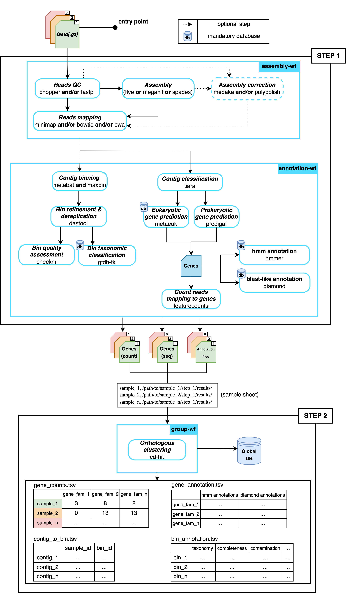

[](https://www.nextflow.io/)
[](https://www.docker.com/)
[](https://sylabs.io/docs/)

# Introduction
This is a two-steps pipeline:
- __step 1__ : sample-wise assembly and annotation of individual metagenome
- __step 2__ : clustering of annotated metagenomes from __step 1__ based on gene families




## Dependencies
- __Software :__  
  - [Nextflow](https://www.nextflow.io/)  
  - [Docker](https://www.docker.com/) and/or [Apptainer/Singularity](https://apptainer.org/)  

- __Database :__
  - Reference proteome(s) in fasta format (i.e. [COG](https://ftp.ncbi.nih.gov/pub/COG/COG2020/data/cog-20.fa.gz), [UniRef100](https://ftp.uniprot.org/pub/databases/uniprot/uniref/uniref100/uniref100.fasta.gz), etc.)
  - [GTDB-Tk database](https://ecogenomics.github.io/GTDBTk/installing/index.html#gtdb-tk-reference-data)
  - HMM profiles databases ([KEGG profiles](https://www.genome.jp/ftp/db/kofam/profiles.tar.gz), [Pfam database](https://ftp.ebi.ac.uk/pub/databases/Pfam/current_release/Pfam-A.hmm.gz), etc.)
  - A pre-built [Kraken2 database](https://benlangmead.github.io/aws-indexes/k2)

- __Edit__ these lines in *nextflow.config* file:  
  ```
  fastaDBs = '/path/to/extracted/proteome/database'
  gtdbtkDB = '/path/to/extracted/gtdbtk/database'
  hmmProfiles = '/path/to/extracted/hmm/profiles'  
  koList = '/path/to/extracted/ko/list'   
  krakenDB = '/path/to/extracted/kraken2/database'
  ```
## How to run the pipeline
__Test your setup and download the containers for off-line use (run once):__
```
nextflow run clustermg.nf \\
  -profile singularity,local,test

nextflow run clustermg.nf \\
  -profile singularity,local,test
  --step2 \\
  --step2_sheet test/step2_input_sheet.tsv
```
__Run step 1 on your data__:
```
nextflow run clustermg.nf \\
  -profile singularity,local \\
  --longReads lr_sample.fastq.gz \\
  --shortReads sr_sample.fastq.gz \\
  --sampleName NAME \\
  --outdir results_1/
```
__Run step 2 on your data__:
```
cat results_*/step2_input_sheet.tsv > input_sheet.tsv
nextflow run clustermg.nf \\
  -profile singularity,local \\
  --step2 \\
  --step2_sheet input_sheet.tsv \\
  --outdir results_step2/
```

## Acknowledgement
This pipeline is inspired by [__nf-core/mag__](https://github.com/nf-core/mag) :  
> nf-core/mag: a best-practice pipeline for metagenome hybrid assembly and binning  
>Sabrina Krakau, Daniel Straub, Hadrien Gourlé, Gisela Gabernet, Sven Nahnsen.  
>NAR Genom Bioinform. 2022 Feb 2;4(1)  
>. doi: [10.1093/nargab/lqac007](https://academic.oup.com/nargab/article/4/1/lqac007/6520104)
